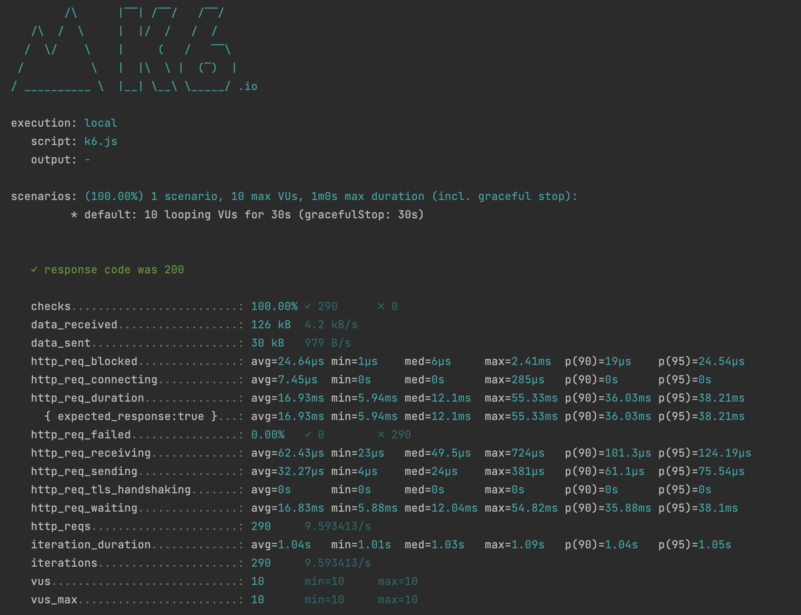

# Task 2

Using the profiles and emails tables from Task 1 above write down the HTML, JavaScript, and
PHP code for the following:

- A single webpage that has an input field for name and a button called search
- Clicking the search button should call a PHP function using ajax
- Show the Firstname, LastName and email address on the page for any matching results



## Prerequisites

You will need :

- **Docker Desktop / Docker Compose**
- **PHP8**

## Framework/Libraries
- Laravel Lumen
- Jquery
- Bootstrap

# Quick start

### 1 : Install dependencies

```shell
composer install
```

### 2 : Run the server

```shell
make run-server
```
### 2: Run the migration

```shell
make migrate
```

### Cleanup (Shutdown all the containers)
```shell
make clean
```

***

## Available Routes

- GET `/api/search`  Track endpoint

# Search Endpoint

```shell
curl --location --request GET 'http://localhost:8000/api/search?name=Briana' \
--header 'Accept: application/json' \
--header 'Content-Type: application/json'
```

## Response

```shell
HTTP/1.1 200 OK
Date: Sat, 11 Mar 2023 03:16:48 GMT
Content-Type: application/json
Content-Length: 36

{
  "data":{
    "firstname":"Briana",
    "lastname":"Buckridge",
    "email":"irwin16@yahoo.com"
  }
}
```

***

# Running k6 script
**Prerequisites:**
- Mac Users : `brew install k6`
- Linux : [Check the link](https://k6.io/docs/get-started/installation/#linux)
- Windows : [Check the link](https://k6.io/docs/get-started/installation/#windows)

```shell
make k6
```
***
> Note : Please find below the credentials for PHPMyadmin

```
http://localhost:8081
Host : db
User :user
Pass : password
```

> Listed below are the possible improvements that could be implemented in this project.

- Implementation of Swagger to generate an API documentation
- Using Test pyramid to improve the code quality 
- Using External libraries to improve the coding standards like (PHP_CodeSniffer, PHPStan ...)
